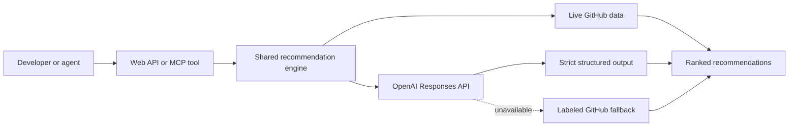

# RepoFinder

RepoFinder turns a project and a goal into a short list of open source tools that genuinely fit.

Paste a GitHub repository or public website, ask for a capability such as production evals or background jobs, and get maintained candidates with three answers: what it is, why it fits this project, and how to prove the integration quickly.

Live at [repofinder.io](https://repofinder.io). Built with Codex, the OpenAI Responses API, GitHub, and Cloudflare.

## Why it is more than a search box

GitHub search can find popular repositories. It does not understand the source project, distinguish a complement from a substitute, or explain an integration path. RepoFinder combines live repository signals with model reasoning, then makes its uncertainty visible.

- Structured outputs keep the model boundary typed and testable.
- Model routing uses a fast tier for extraction and a reasoning tier for curation.
- Live GitHub metrics ground stars, maintenance, momentum, forks, and contributors.
- A labeled GitHub fallback keeps the demo useful if OpenAI is unavailable.
- One engine powers the web API and the remote MCP tool.
- A checked-in Codex skill teaches agents when to call the tool.
- Deterministic tests and an LLM eval harness cover different failure classes.
- Cloudflare-native rate limits protect public model routes from spend amplification.
- Operational telemetry is explicitly allowlisted, disclosed in the product, and excludes cookies, authorization headers, query strings, and request bodies.

## Architecture



The recommendation logic exists only in [`src/engine.ts`](./src/engine.ts). [`src/index.ts`](./src/index.ts) exposes HTTP, [`src/mcp.ts`](./src/mcp.ts) exposes `recommend_repos`, and [`src/openai.ts`](./src/openai.ts) contains the provider-specific Responses API adapter.

## Try it locally

```bash
npm install
cp .dev.vars.example .dev.vars
npm run dev
```

Add `OPENAI_API_KEY` to `.dev.vars` for model-ranked recommendations. `GITHUB_TOKEN` is optional but raises GitHub API limits. Without an OpenAI key, the product deliberately runs its labeled GitHub fallback.

Quality gates:

```bash
npm run typecheck
npm test
npm run eval -- --no-judge
```

The complete model eval requires an OpenAI key. Results are cached under `evals/.cache`, which is ignored by Git.

## Use it from Codex

This repository checks in a project-scoped MCP configuration:

```toml
[mcp_servers.repofinder]
url = "https://repofinder.io/mcp"
```

The [`find-complementary-repos` skill](./.agents/skills/find-complementary-repos/SKILL.md) adds workflow guidance on top of the tool. MCP provides capability. The skill provides judgment about when and how to use it.

## Deploy to the isolated Cloudflare service

The Worker, D1 database, domain, and secrets are all named for RepoFinder and are not shared with RepoRecommender.

```bash
npx wrangler d1 execute repofinder-io --remote --file=schema.sql
npx wrangler secret put OPENAI_API_KEY
npx wrangler secret put GITHUB_TOKEN
npx wrangler secret put TELEGRAM_BOT_TOKEN
npx wrangler secret put TELEGRAM_CHAT_ID
npm run deploy
```

For an existing database, apply new files in [`migrations`](./migrations) before deployment. The current migration is:

```bash
npx wrangler d1 execute repofinder-io --remote --file=migrations/0001_request_log.sql
```

The [privacy page](https://repofinder.io/privacy) describes the request fields stored in D1 and sent in operator notifications.

The production configuration is in [`wrangler.jsonc`](./wrangler.jsonc). Never commit real keys.

## Learn from the build

The [`lessons`](./lessons) directory is a compact course built around the actual product:

1. [Define the demo outcome](./lessons/01-demo-outcome.md)
2. [Design one engine and two surfaces](./lessons/02-one-engine-two-surfaces.md)
3. [Steer Codex with AGENTS.md](./lessons/03-agents-md.md)
4. [Turn workflow knowledge into skills](./lessons/04-codex-skills.md)
5. [Use the Responses API](./lessons/05-responses-api.md)
6. [Make model output a contract](./lessons/06-structured-outputs.md)
7. [Route models and design fallbacks](./lessons/07-model-routing-and-fallbacks.md)
8. [Expose the engine through MCP](./lessons/08-remote-mcp.md)
9. [Protect a tool that fetches URLs](./lessons/09-security-boundaries.md)
10. [Separate tests from evals](./lessons/10-tests-and-evals.md)
11. [Keep Cloudflare resources isolated](./lessons/11-cloudflare-isolation.md)
12. [Ship and tell the demo story](./lessons/12-ship-the-demo.md)
13. [Separate chat from operator telemetry](./lessons/13-chat-and-telemetry.md)
14. [Rotate exposed secrets](./lessons/14-secrets-and-keys.md)
15. [Use Codex as a build loop](./lessons/15-build-with-codex.md)

## Origin

RepoFinder grew out of [RepoRadar.io](https://reporadar.io), which placed second out of 302 teams at a global generative UI hackathon. This rebuild focuses on the work after the prototype: reusable architecture, visible failure handling, evaluation, safety, deployment discipline, and a narrative another developer can learn from.
