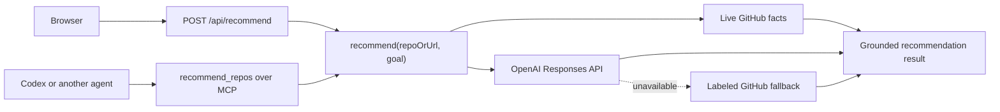
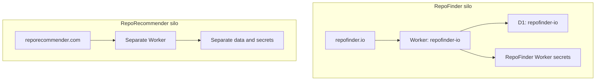
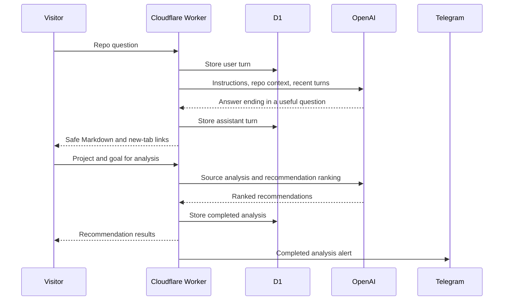

# Architecture decisions

## One engine, two surfaces

The browser and MCP clients call the same `recommend` function. This prevents prompt, ranking, and fallback behavior from drifting across interfaces.

## One provider boundary

Only `src/openai.ts` knows the OpenAI wire format. The engine owns schemas and product prompts. That keeps provider changes small and makes model behavior visible during review.

## Grounded ranking

The model does not invent repository metrics. GitHub supplies facts. OpenAI interprets fit and writes integration guidance inside a strict schema.

## Visible degradation

Missing keys and provider errors fall back to live GitHub ranking. The response includes `mode`, and the interface labels it. A working but less personalized answer is better than a failed demo, as long as the limitation is explicit.

## Deployment boundary

RepoFinder owns a Worker, D1 database, custom domain, GitHub repository, and secrets. No runtime resource is shared with RepoRecommender.

## Chat and activity boundary

The browser and operator views are intentionally different. The browser renders an escaped Markdown subset with safe new-tab links. D1 stores complete chat turns and passive request telemetry. Telegram receives one operator-focused alert only after a valid analysis completes. Request metadata comes from an allowlist, never from serializing the request object.

