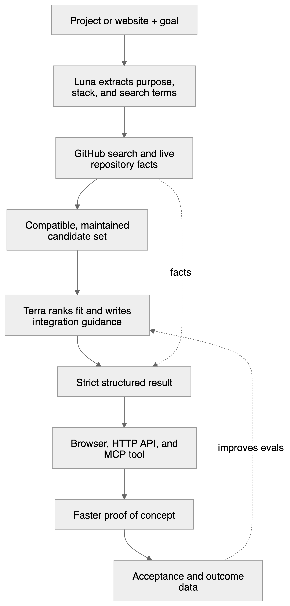
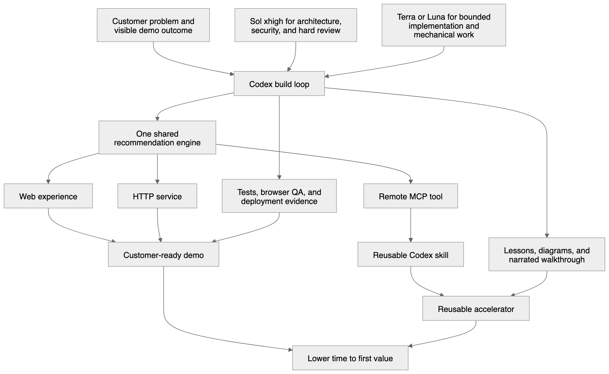

# RepoFinder interview and publishing brief

Use this as the source for a blog post, a website project page, and follow-up interview talking points. The central story is not that an AI wrote code. The story is that OpenAI made a useful customer outcome possible, and Codex changed the economics of turning that capability into a demo people can trust, use, and reuse.

Visual rehearsal: [101-second narrated walkthrough](./video/repofinder-walkthrough.mp4).

## The story in one sentence

I used OpenAI twice: the Responses API turns live GitHub facts into project-specific recommendations, and Codex turned that product idea into a customer-ready web experience, HTTP service, remote MCP tool, reusable skill, test suite, and lesson book in a focused build sprint.

## The 30 second version

RepoFinder answers a common developer question: “What should I add to this project?” Give it a GitHub repository or website and a goal, such as production evals. It reads the source, searches live GitHub, and uses the OpenAI Responses API to rank the candidates for this specific project. The result includes what each repository does, why it fits, how to try it, and current maintenance signals.

The compelling part is the change in the user’s workflow. Instead of opening search results, comparing README files, and guessing which popular tool fits the actual stack, a builder gets a grounded shortlist and a concrete next step. The same engine is available to a person in the browser and to Codex through MCP, so the research can become part of the development workflow instead of ending in another tab.

## Why this is a compelling demo

A strong demo makes one valuable transformation easy to see. RepoFinder starts with ambiguity and ends with a decision the audience can inspect.

1. The input is familiar: a project and a goal.
2. The source data is live: GitHub owns stars, language, activity, and repository identity.
3. OpenAI supplies the judgment: which candidates complement this project, why they fit, and how to test one.
4. The output is actionable: every recommendation links to the repository and explains an integration path.
5. The capability travels: the browser, HTTP API, MCP tool, and Codex skill all use the same recommendation engine.

This gives the presenter a clean before and after. Before, the developer has a search problem. After, the developer has three candidates, evidence, and a proof-of-concept path.

## Where the return comes from

RepoFinder creates value at three levels.

### Builder return

- Shorter time from “we need a capability” to a credible shortlist.
- Less time spent reading repositories that are popular but incompatible, abandoned, educational rather than installable, or substitutes for the current project.
- A smaller and safer next step because the answer includes an integration path, not just a list.

The metric I would lead with is time to first proof of concept. Supporting metrics are recommendation acceptance, repository click-through, fallback rate, and cost per completed analysis.

### Demo team return

- One capability can be shown to a customer in a browser, called by normal software over HTTP, or used by an agent through MCP.
- One shared engine keeps the demo script, API behavior, and agent behavior aligned.
- A labeled fallback keeps the core experience useful during a provider or billing problem without pretending that deterministic ranking is model reasoning.
- The checked-in skill and lesson book turn a successful demo pattern into a reusable accelerator for the next engagement.

### Engineering return

- Model routing pays for intelligence at the decision points, not for every token.
- Structured Outputs remove recovery code and give downstream surfaces a stable contract.
- GitHub remains the source of objective repository facts, which makes the model’s job narrower and the answer easier to trust.
- Codex compresses the work around the model call: mapping the codebase, implementing the boundary, testing adversarial cases, exercising the browser, deploying, and documenting the result.

Blog assets: [PNG](../diagrams/repofinder-openai-value-loop.png), [SVG](../diagrams/repofinder-openai-value-loop.svg), [Mermaid source](../diagrams/repofinder-openai-value-loop.mmd), and [editable Excalidraw](../diagrams/repofinder-openai-value-loop.excalidraw).

## How OpenAI creates the product value

### 1. GitHub supplies evidence

RepoFinder fetches the source repository metadata and README, asks GitHub for candidates, removes obvious non-tools and incompatible ecosystems, and enriches the final choices with current repository facts. See the [source analysis and GitHub candidate pipeline](https://github.com/motozero/repofinder.io/blob/main/src/engine.ts#L232-L400).

### 2. The Responses API turns evidence into judgment

The source project, goal, and candidate facts go to one provider adapter in [`src/openai.ts`](https://github.com/motozero/repofinder.io/blob/main/src/openai.ts#L1-L110). The request makes the product choices visible: model, instructions, input, output limit, reasoning effort, verbosity, schema, and `store: false`.

OpenAI recommends the Responses API for new projects because it provides one interface for model responses, reasoning, tools, multimodal input, and multi-turn state. RepoFinder needs only a small part of that surface today, but choosing the current primitive leaves a direct path to richer agent workflows later. See OpenAI’s [Responses API migration guide](https://developers.openai.com/api/docs/guides/migrate-to-responses).

### 3. Structured Outputs make the answer usable by software

RepoFinder does not ask the model to “please return JSON” and then search for a code fence. It supplies strict JSON Schemas for source analysis and recommendations. The browser API and MCP tool receive the same typed result. OpenAI’s [Structured Outputs guide](https://developers.openai.com/api/docs/guides/structured-outputs) explains why schema adherence is stronger than JSON mode alone.

### 4. The model interprets fit, not facts

GitHub owns repository identity and maintenance signals. OpenAI compares those candidates against the source project and writes the project-specific why and how. The engine then rejects any model-selected repository that was not in GitHub’s candidate map. See the [curation step and candidate check](https://github.com/motozero/repofinder.io/blob/main/src/engine.ts#L439-L513).

That division of labor is important in a customer demo. The audience can see where evidence stops and model judgment begins.

## Model and reasoning strategy

There are two separate model decisions in this story. Keeping them separate makes the cost explanation credible.

### Runtime models inside RepoFinder

| Work | Model and effort | Why |
| --- | --- | --- |
| Extract purpose, stack, and search terms | GPT-5.6 Luna, `none` | Bounded, high-volume transformation with a strict schema. Optimize for speed and cost. |
| Rank candidates and write project-specific guidance | GPT-5.6 Terra, `medium` | This step requires comparative judgment and produces customer-facing reasoning. Spend more where answer quality changes the decision. |
| Hardest ambiguous ranking cases | Evaluate Sol only if evals show a gain | Sol is not the default because every public request would inherit its higher cost. Escalate measured hard cases, not the whole route. |

The routing table is visible in [`src/openai.ts`](https://github.com/motozero/repofinder.io/blob/main/src/openai.ts#L7-L12). The actual effort choices are visible in [`src/engine.ts`](https://github.com/motozero/repofinder.io/blob/main/src/engine.ts#L263-L323) and the [ranking call](https://github.com/motozero/repofinder.io/blob/main/src/engine.ts#L473-L480).

At the time of writing, the public API catalog lists Luna at $1 input and $6 output per million tokens, Terra at $2.50 and $15, and Sol at $5 and $30. Prices change, so the blog should link to the current [OpenAI model catalog](https://developers.openai.com/api/docs/models) rather than treating these numbers as permanent.

### Codex models used to build and verify the demo

Build-time routing follows the same principle:

- Use GPT-5.6 Sol with extra-high reasoning for ambiguous architecture, security review, cross-system debugging, and final quality gates where a missed issue is expensive.
- Use Terra at a lower effort for normal implementation, refactoring, documentation, and review passes that need judgment but have clear boundaries.
- Use Luna or low effort for focused extraction, file mapping, classification, and repetitive edits.

Higher reasoning effort can improve difficult work, but it also takes longer and uses more tokens. The right question is not “Which model is best?” It is “At which decision would more intelligence change the outcome?” OpenAI’s [GPT-5.6 model guidance](https://developers.openai.com/api/docs/guides/latest-model) recommends testing the same reasoning effort and one level lower on representative work instead of assuming that maximum effort is always the best trade.

Be precise in the interview: Luna and Terra are the application’s production runtime policy. Sol with extra-high reasoning is the Codex policy for the hardest build and review steps. They solve different cost problems.

## How Codex changed the economics of the demo

The value of Codex was not a burst of generated TypeScript. It was the closed loop from idea to evidence.

1. `AGENTS.md` made architecture, security, style, and verification rules durable across turns.
2. Codex inspected the existing repository and current OpenAI and Cloudflare documentation before changing the system.
3. It planned around visible contracts: one shared engine, a clean customer experience, a remote MCP tool, safe persistence, useful operator signals, and an explainable fallback.
4. It implemented and reviewed the product in small patches.
5. It added deterministic tests for exact code behavior and evals for variable model quality.
6. It exercised the real browser, deployed the Worker, checked production, and updated the lessons and walkthrough.
7. It captured the repeatable repository-discovery workflow as a skill instead of leaving it as a one-off prompt.

The Git history makes the speed claim concrete. The [first OpenAI-native build commit](https://github.com/motozero/repofinder.io/commit/649e808) landed at 11:59 p.m. The [production launch hardening and canary](https://github.com/motozero/repofinder.io/commit/94830ea) landed by 12:33 a.m. That is the focused one-hour build sprint. Later work added the richer guided UI, telemetry controls, adversarial tests, lesson book, and narrated walkthrough. This distinction is more credible than claiming the entire polished product appeared in an hour.

Blog assets: [PNG](../diagrams/codex-demo-economics.png), [SVG](../diagrams/codex-demo-economics.svg), [Mermaid source](../diagrams/codex-demo-economics.mmd), and [editable Excalidraw](../diagrams/codex-demo-economics.excalidraw).

OpenAI’s current Codex guidance supports the pattern used here: give Codex a goal, context, constraints, and a definition of done; place durable repository rules in `AGENTS.md`; connect changing external systems with MCP; and package repeatable workflows as skills. See the official Codex guides for [best practices](https://learn.chatgpt.com/guides/best-practices), [`AGENTS.md`](https://learn.chatgpt.com/docs/agent-configuration/agents-md), and [building skills](https://learn.chatgpt.com/docs/build-skills).

## One engine, several returns

The core recommendation logic exists once in [`src/engine.ts`](https://github.com/motozero/repofinder.io/blob/main/src/engine.ts).

- [`src/index.ts`](https://github.com/motozero/repofinder.io/blob/main/src/index.ts#L31-L145) exposes the browser and HTTP API.
- [`src/mcp.ts`](https://github.com/motozero/repofinder.io/blob/main/src/mcp.ts#L1-L40) exposes `recommend_repos` over Streamable HTTP.
- [The Codex skill](https://github.com/motozero/repofinder.io/blob/main/.agents/skills/find-complementary-repos/SKILL.md) teaches an agent when to call the MCP tool and when to stop before changing dependencies.
- [`public`](https://github.com/motozero/repofinder.io/tree/main/public) contains the human-facing demo.
- [`tests`](https://github.com/motozero/repofinder.io/tree/main/tests) and [`evals`](https://github.com/motozero/repofinder.io/tree/main/evals) provide deterministic and model-quality evidence.
- [`lessons`](https://github.com/motozero/repofinder.io/tree/main/lessons) turns the build into a one-hour learning path.
- [`wrangler.jsonc`](https://github.com/motozero/repofinder.io/blob/main/wrangler.jsonc) makes the isolated deployment and rate-limit boundary visible.

This is a useful Demo Experience Engineer pattern: build the narrow customer moment first, then design the capability so it can become a reusable accelerator without making the first demo feel like a platform pitch.

## A 90 second demo path

1. **Set the stakes.** “GitHub search finds popular repositories. It does not know what this project is, whether a result complements it, or how I would try it.”
2. **Enter one real project and goal.** Use `openai/openai-node` and `production evals`.
3. **Show the transformation.** Point out the project summary, live repository signals, fit explanation, integration path, and direct links.
4. **Make the OpenAI boundary visible.** “GitHub supplies the evidence. OpenAI supplies the project-specific judgment.”
5. **Show reuse.** Call `recommend_repos` from Codex or show the MCP definition. “The interface changed. The product logic did not.”
6. **Close on economics.** “Codex helped turn this from an idea into a web demo, API, agent tool, test suite, and learning asset in a focused sprint. The return is both a useful result for the developer and a reusable capability for the next customer.”

## Interview talking points

### Why OpenAI

- The Responses API gives the project a current, explicit boundary for model input, reasoning effort, structured output, privacy choice, and future tool use.
- Structured Outputs turn model behavior into a software contract.
- The GPT-5.6 family lets the product buy different levels of intelligence for extraction and judgment instead of paying flagship cost everywhere.
- Codex covers the whole engineering loop, including research, code, tests, browser evidence, deployment, and documentation.
- MCP and skills let the finished capability become part of the agent workflow.

### Why this demo, not a generic chatbot

- It solves a specific and expensive developer decision.
- It combines live evidence with model judgment.
- The output is inspectable and immediately actionable.
- It demonstrates web, API, and agent surfaces without changing the core behavior.
- It has a visible failure mode and a useful fallback.

### What I would improve next

- Build a small reference dataset from real repository choices.
- Measure recommendation acceptance and time to first proof of concept.
- Compare Terra and Sol on the hardest ranking examples, then keep Sol only where the quality gain pays for itself.
- Track cost per completed analysis, schema failures, fallback rate, and repository click-through.
- Add retention controls and deletion workflows before treating telemetry as a long-term product system.

## Website project description

### Short version

RepoFinder turns a GitHub repository or website plus a goal into a project-specific shortlist of open-source tools. It combines live GitHub evidence with the OpenAI Responses API, then serves the same capability through a web experience, HTTP API, remote MCP tool, and Codex skill. I built it with Codex as a demonstration of how OpenAI can compress both the developer’s research loop and the work required to ship a dependable customer demo.

### Card version

**RepoFinder.io** 
An OpenAI-powered repository advisor for developers. Enter a project and a goal, then get maintained, compatible open-source recommendations with live evidence, fit reasoning, and integration guidance. One shared engine powers the browser, API, and MCP tool. Built with Codex, the Responses API, GitHub, and Cloudflare.

## Follow-up note

I kept thinking about our conversation and built RepoFinder to make the Demo Experience Engineer role concrete. The product combines live GitHub facts with the OpenAI Responses API to turn a project and goal into an actionable repository shortlist. The larger experiment was using Codex across the full demo loop: architecture, implementation, testing, browser QA, deployment, MCP packaging, and the lesson book. What interested me most was the economics. One focused build produced a customer-facing demo, a normal API, an agent tool, and a reusable skill without duplicating the core logic. The live demo is [repofinder.io](https://repofinder.io), and the implementation and build lessons are in [motozero/repofinder.io](https://github.com/motozero/repofinder.io).

## Questions for the hiring manager

- Where does the team draw the line between a customer-specific demo and a reusable accelerator?
- Which failure mode most often separates an impressive prototype from a field-ready demo?
- How does the team measure demo quality, reuse, and customer impact after delivery?
- Where could Codex most improve the team’s demo development loop today?
- What does excellent partnership between Demo Experience, Solutions, Product, and Research look like?

## Evidence index

- Live demo: [repofinder.io](https://repofinder.io)
- Source: [motozero/repofinder.io](https://github.com/motozero/repofinder.io)
- Shared engine: [`src/engine.ts`](https://github.com/motozero/repofinder.io/blob/main/src/engine.ts)
- Responses API adapter: [`src/openai.ts`](https://github.com/motozero/repofinder.io/blob/main/src/openai.ts)
- HTTP surface: [`src/index.ts`](https://github.com/motozero/repofinder.io/blob/main/src/index.ts)
- MCP surface: [`src/mcp.ts`](https://github.com/motozero/repofinder.io/blob/main/src/mcp.ts)
- Codex skill: [`.agents/skills/find-complementary-repos/SKILL.md`](https://github.com/motozero/repofinder.io/blob/main/.agents/skills/find-complementary-repos/SKILL.md)
- Lessons: [`lessons`](https://github.com/motozero/repofinder.io/tree/main/lessons)
- Architecture notes: [`docs/architecture.md`](https://github.com/motozero/repofinder.io/blob/main/docs/architecture.md)
- Test suite: [`tests`](https://github.com/motozero/repofinder.io/tree/main/tests)
- Model evals: [`evals`](https://github.com/motozero/repofinder.io/tree/main/evals)
- Walkthrough video: [`docs/video/repofinder-walkthrough.mp4`](https://github.com/motozero/repofinder.io/blob/main/docs/video/repofinder-walkthrough.mp4)
