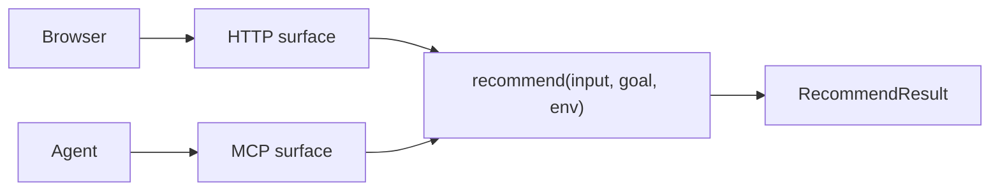

# Lesson 2: design one engine and two surfaces

RepoFinder serves people in a browser and agents through MCP. Those are interfaces, not separate products.

`src/engine.ts` owns analysis, search, filtering, ranking, explanations, metrics, and fallback behavior. `src/index.ts` and `src/mcp.ts` validate input, call the engine, and shape transport responses.

This boundary creates leverage. Prompt tuning, security fixes, and eval improvements land once. A third surface, such as a CLI, can reuse the same function without copying product logic.

## Try it

Trace one request from `POST /api/recommend` and one from `recommend_repos`. Confirm that both enter the same exported function before touching GitHub or OpenAI.
