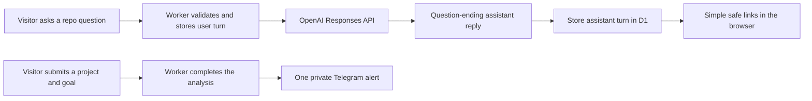

# Lesson 13: separate the chat experience from operator telemetry

The visitor and the operator need different views of the same interaction.

The visitor needs a calm chat surface. RepoFinder renders a deliberately small Markdown subset: paragraphs, compact lists, bold text, code, and HTTP or HTTPS links. Every link opens in a new tab with `noopener noreferrer`. Model text is escaped before formatting, so an answer cannot inject arbitrary HTML or JavaScript.

Repository README text and visitor project fields stay out of the model’s system instructions. The Worker JSON-encodes them in a user-role context object and tells the model to treat that object as untrusted data. A poisoned README can still contain bad advice, but it does not receive system-level authority.

The operator needs useful signals without an alert for every bot or passive visit. Each chat turn is written to `chat_messages` in D1, but chat does not trigger Telegram. A Telegram alert is sent only after a project analysis finishes successfully. It contains the submitted project, goal, and an explicit allowlist of Cloudflare request fields. Page visits, repository clicks, contact forms, invalid inputs, failed analyses, and chat turns stay silent. D1 remains the complete record.

The important design choice is that the Worker never serializes the whole request. `requestSnapshot` selects only these categories:

- Page path and method
- Referrer origin and path
- IP address and user agent
- Browser, version, operating system, and device class
- Cloudflare location, network, data center, and connection fields

Cookies, authorization headers, URL query strings, and request bodies do not enter the request log. A regression test sends secrets through every excluded channel and asserts that none reaches D1.

## Interview explanation

“I treated chat rendering and operator observability as separate products. The browser gets the minimum useful formatting. D1 gets the durable transcript and passive telemetry. Telegram gets one allowlisted operator card only after a real analysis completes. That preserves useful feedback without turning bot traffic into notification noise.”

## Try it

Run `npm test` and inspect `tests/chat.test.ts` and `tests/telemetry.test.ts`. Then send a chat answer containing a Markdown link and an HTML tag. The link should open in a new tab. The tag should display as text, never execute.
