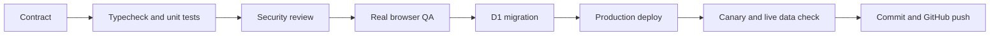

# Lesson 15: use Codex as a build loop, not a code generator

The useful unit of Codex work is a verified outcome. RepoFinder was built through a loop that made context, implementation, and evidence reinforce each other.

## 1. Give Codex durable context

The request described the customer experience, interview stakes, deployment boundary, and desired learning artifact. `AGENTS.md` supplied constraints that should remain true on every turn: one engine, two surfaces, one provider boundary, explicit model roles, no committed secrets, and browser QA before declaring success.

## 2. Inspect before editing

Codex mapped the existing repository, Cloudflare configuration, D1 schema, chat flow, and public UI. It checked current OpenAI and Cloudflare documentation for details that can change over time. That separated facts from memory and prevented an implementation based on stale API assumptions.

## 3. Plan around user-visible outcomes

The work was split into four contracts:

- Clean browser chat with useful links
- Durable Q&A records in D1
- One private Telegram card per completed analysis
- Clear privacy and secret-handling boundaries

Each contract had a verification path before implementation began.

## 4. Build in a safe workspace

The active desktop sandbox could read the RepoFinder repository but could not write to it. Codex made a no-hardlink clone under `/private/tmp`, edited it with reviewable patches, and reused the original dependency installation only for local checks. The tested diff was applied back to RepoFinder only after typecheck and unit tests passed.

## 5. Attack the boundary conditions

The adversarial pass covered script injection in model output, unsafe link protocols, Telegram notification timing, malformed chat session IDs, direct API calls with invalid repository names, request secrets in headers and bodies, query-string leakage, missing Cloudflare fields, and desktop versus mobile user agents.

One test caught a real design mismatch: the app removed its own query string but initially retained a query string inside the referrer. Codex fixed the implementation and added a regression test before deployment.

## 6. Verify at every layer

Deterministic tests prove exact code behavior. Browser QA proves the actual customer flow. D1 queries prove storage. A single completed-analysis Telegram delivery proves the operator loop stays useful without passive-traffic noise. A production canary proves the deployed artifact, not just the local checkout.

## Interview explanation

“I used Codex as a closed-loop engineering partner. I gave it durable constraints, had it inspect the real system, required a plan tied to visible outcomes, and made it produce evidence at the unit, browser, database, notification, and deployment layers. The code matters, but the reusable capability is the loop.”

## Try it

Read the Git history beside the tests and QA report. For each claim in the demo, point to one visible behavior and one source artifact that proves it.
